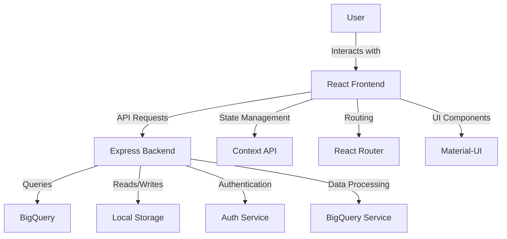
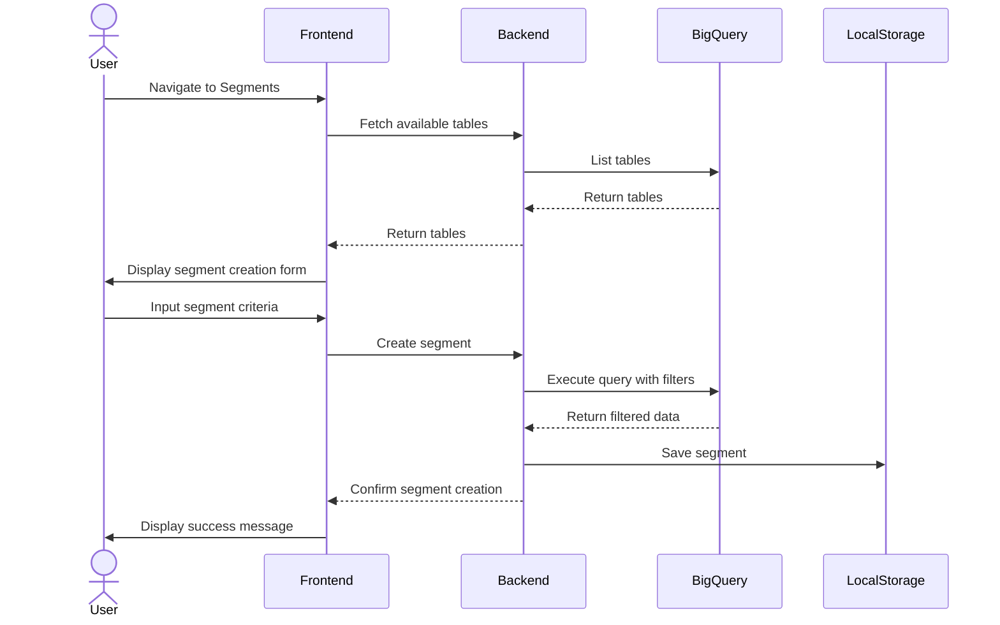
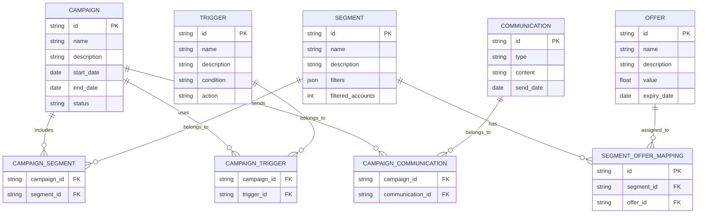

# System Diagrams

## Architecture Diagram

```mermaid
graph TD
    A[User] -->|Interacts with| B[React Frontend]
    B -->|API Requests| C[Express Backend]
    C -->|Queries| D[BigQuery]
    C -->|Reads/Writes| E[Local Storage]
    B -->|State Management| F[Context API]
    B -->|Routing| G[React Router]
    B -->|UI Components| H[Material-UI]
    C -->|Authentication| I[Auth Service]
    C -->|Data Processing| J[BigQuery Service]
```

## Sequence Diagram (for creating a segment)

```mermaid
sequenceDiagram
    actor User
    participant Frontend
    participant Backend
    participant BigQuery
    participant LocalStorage

    User->>Frontend: Navigate to Segments
    Frontend->>Backend: Fetch available tables
    Backend->>BigQuery: List tables
    BigQuery-->>Backend: Return tables
    Backend-->>Frontend: Return tables
    Frontend->>User: Display segment creation form
    User->>Frontend: Input segment criteria
    Frontend->>Backend: Create segment
    Backend->>BigQuery: Execute query with filters
    BigQuery-->>Backend: Return filtered data
    Backend->>LocalStorage: Save segment
    Backend-->>Frontend: Confirm segment creation
    Frontend->>User: Display success message
```

## Data Model

```mermaid
erDiagram
    CAMPAIGN {
        string id PK
        string name
        string description
        date start_date
        date end_date
        string status
    }
    SEGMENT {
        string id PK
        string name
        string description
        json filters
        int filtered_accounts
    }
    TRIGGER {
        string id PK
        string name
        string description
        string condition
        string action
    }
    OFFER {
        string id PK
        string name
        string description
        float value
        date expiry_date
    }
    COMMUNICATION {
        string id PK
        string type
        string content
        date send_date
    }
    SEGMENT_OFFER_MAPPING {
        string id PK
        string segment_id FK
        string offer_id FK
    }
    CAMPAIGN_SEGMENT {
        string campaign_id FK
        string segment_id FK
    }
    CAMPAIGN_TRIGGER {
        string campaign_id FK
        string trigger_id FK
    }
    CAMPAIGN_COMMUNICATION {
        string campaign_id FK
        string communication_id FK
    }

    CAMPAIGN ||--o{ CAMPAIGN_SEGMENT : includes
    CAMPAIGN ||--o{ CAMPAIGN_TRIGGER : uses
    CAMPAIGN ||--o{ CAMPAIGN_COMMUNICATION : sends
    SEGMENT ||--o{ CAMPAIGN_SEGMENT : belongs_to
    SEGMENT ||--o{ SEGMENT_OFFER_MAPPING : has
    TRIGGER ||--o{ CAMPAIGN_TRIGGER : belongs_to
    OFFER ||--o{ SEGMENT_OFFER_MAPPING : assigned_to
    COMMUNICATION ||--o{ CAMPAIGN_COMMUNICATION : belongs_to
```
